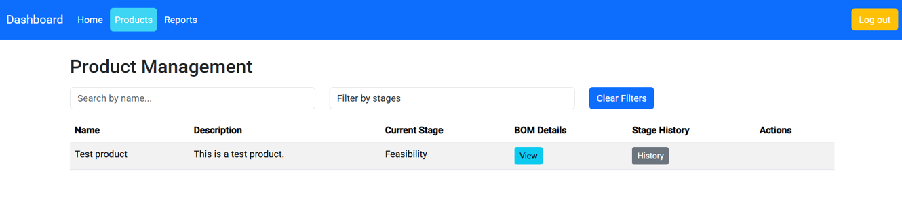
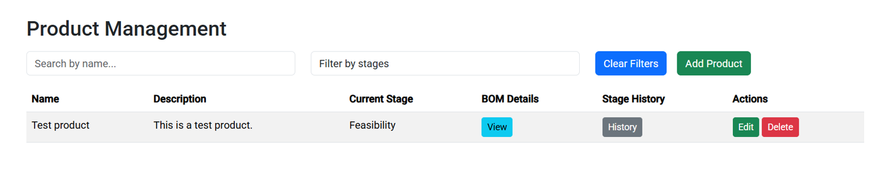
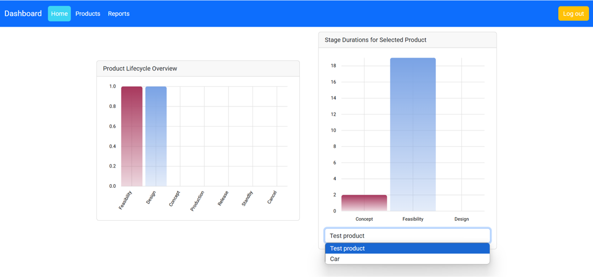
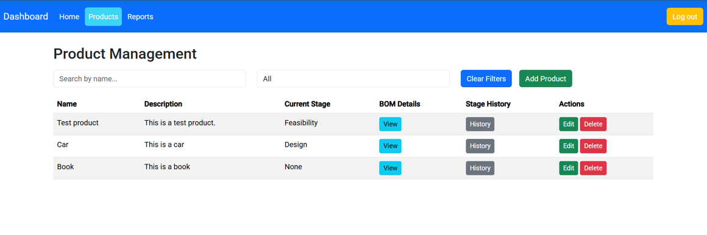
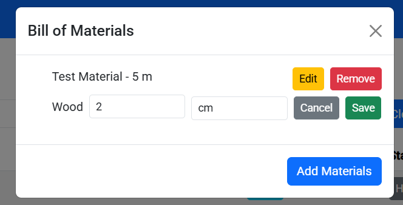
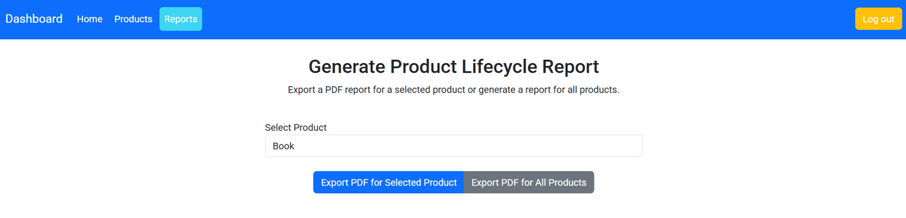
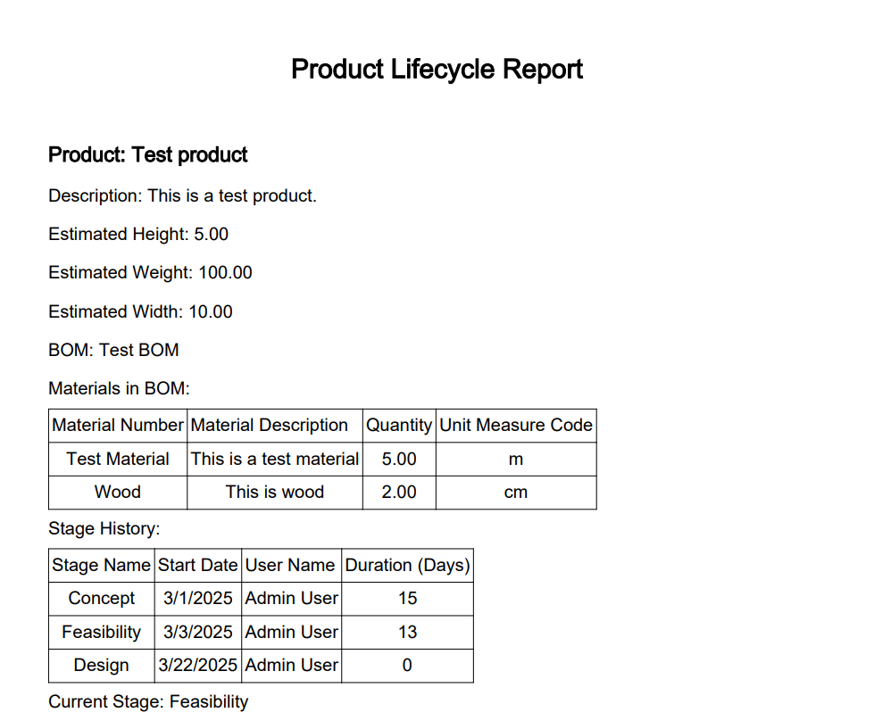

# Product Lifecycle Management (PLM) Application

## Photos
# The site when a normal user is logged in

# The site when an admin user is logged in

# Dashboard containing statistics

# Products page

# Modal for BOM

# Reports page

# Report PDF example

This application manages the lifecycle of products in a company, handling their various stages and related data. It includes both backend (C# with Entity Framework Core) and frontend (Angular) components, with database management and user role assignments.

## Project Overview

### Backend
The backend is implemented in C# with Entity Framework Core and is responsible for managing products, stages, users, roles, BOMs (Bill of Materials), and more. It handles the logic for moving products through various stages, generating reports, and ensuring data integrity.

### Frontend
The frontend is built with Angular and Bootstrap. It provides two interfaces:
- **User Interface**: Allows users to view products, filter by relevant characteristics, and move products between stages.
- **Admin Interface**: Provides CRUD operations for products, the ability to change product statuses, and optional statistics and report generation.

### Database Structure
The application uses the following entities:

1. **Product**
   - `id`: Primary key
   - `name`: Name of the product
   - `description`: Description of the product

2. **Stage**
   - `stage_id`: Foreign key
   - `product_id`: Foreign key
   - `start_of_stage`: Date when the stage started
   - `user`: Foreign key (the user who set the stage)
   - **Composite Primary Key**: `stage_id`, `product_id`, `start_of_stage`

3. **Product Stage History**
   - `id`: Primary key
   - `product_id`: Foreign key to Product
   - `stage_id`: Foreign key to Stage
   - `start_of_stage`: Start date of the stage
   - `user`: Foreign key to User

4. **BOM (Bill of Materials)**
   - Contains details about the materials needed for assembling a finished product.

5. **Bom Material**
   - `material_number`: Foreign key to Material
   - `bom_id`: Foreign key to BOM
   - `qty`: Quantity (in grams, kg, meters, etc.)
   - `unit_measure_code`: Measurement unit (e.g., UCUM)
   - **Composite Primary Key**: `bom_id`, `material_number`

6. **Material**
   - `id`: Primary key
   - `material_description`: Description of the material
   - `weight`: Weight per piece
   - `width`: Width of the material
   - `height`: Height of the material

7. **User**
   - `id`: Primary key
   - `email`: Email of the user
   - `name`: Name of the user
   - `phone_number`: Phone number of the user

8. **Roles**
   - `role_id`: Primary key
   - `role_name`: Name of the role (e.g., Admin, Designer, Portfolio Management, Seller)

9. **User Roles**
   - Many-to-Many relationship between Users and Roles
   - **Composite Primary Key**: `user_id`, `role_id`

### Product Lifecycle Phases
A product can exist in one of the following stages:
1. Concept
2. Feasibility
3. Design
4. Production
5. Withdrawal
6. Standby
7. Cancel

### Features
- **User Interface**: 
  - View available products
  - Filter products by characteristics
  - Change product phase (e.g., move from Design to Production)
  
- **Admin Interface**: 
  - CRUD operations on products
  - Change product status
  - Generate reports in PDF format using JasperReports
  
- **Reports**: 
  - Generate PDF reports detailing the products in the system.

## Technologies Used

- **Backend**: C# with Entity Framework Core
- **Frontend**: Angular with Bootstrap
- **Database**: MySQL (or any other preferred RDBMS)

## Setup and Installation

### Backend Setup

1. **Clone the repository**:

Open the solution

Install necessary NuGet packages:

Make sure you have the required NuGet packages for Entity Framework Core and your chosen database.

dotnet restore
Configure the database connection in appsettings.json:

"ConnectionStrings": {
  "DefaultConnection": "Server=your-server;Database=plm_database;User Id=your-username;Password=your-password;"
}

Apply migrations to set up the database schema:

dotnet ef database update

Run the backend API:

dotnet run
Frontend Setup
Clone the frontend repository:

git clone https://github.com/xnabber/plm-frontend.git
cd plm-frontend
Install dependencies:

npm install
Run the Angular application:

ng serve
Access the frontend at http://localhost:4200.

Environment Configuration

Make sure the backend API is running before you start the frontend.
Update the API endpoints in the frontend as necessary to match the backend configuration.
